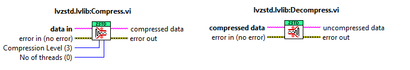

# lvzstd Zstandard Compression

A LabVIEW compression library using the [Zstandard compression
algorithm](https://github.com/facebook/zstd). ZStandard is a fast
lossless compression algorithm, targeting real-time compression
scenarios at zlib-level and better compression ratios.

Supports multithraded Zstandard compression/decompression on:

* Windows (x86, 32/64-bit)
* Linux (x86 64-bit)
* NI Real-Time Linux (x86 64-bit)

Features:

* VIs are thread safe, reentrant, and can be called in parallel
* when compressing, can optionally set the number of threads and the
  compresssion level

This package relies on a compile library (.dll/.so), which is also
distributed at `vi.lib/samangh/lvzstd Zstandard Compression/Libraries`.

Developed in LabVIEW 2020, but compatible with earlier versions of
LabVIEW.

## Installation

You can install it using the VI package manager. Alternatively, the VI
package is also available to download from
[releases](https://github.com/samangh/wamplv/lvzstd/releases).

## Usage

Should be super easy to compress/decompress. For extra details, see
`ReadMe.vi` and `Example.vi`.

## License

Licensed under MIT. See [LICENSE](LICENSE).
